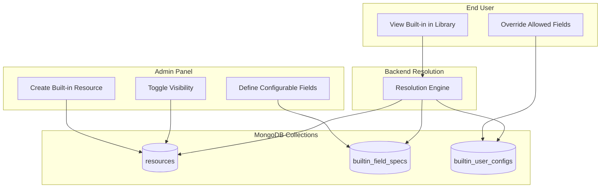
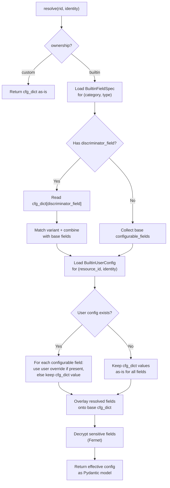
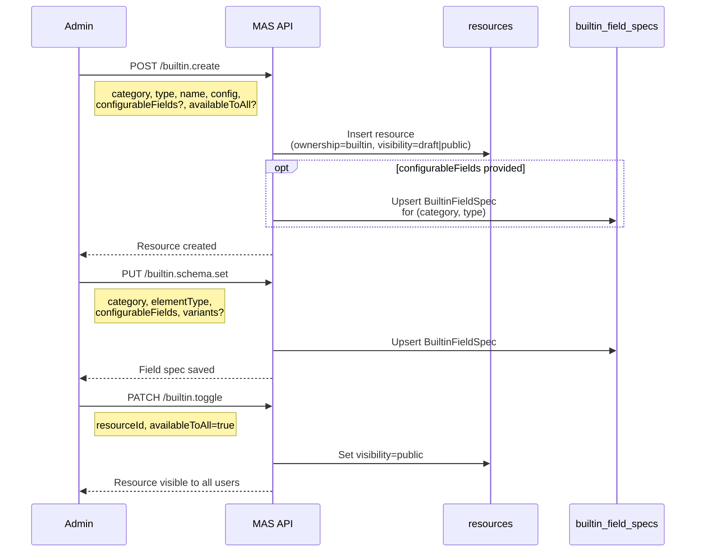
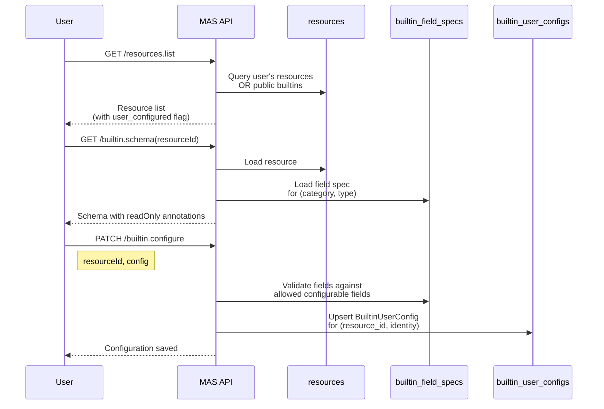
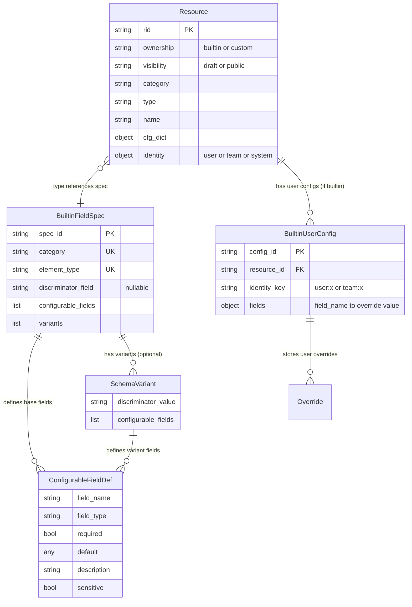

# Built-in Resource System — Design Document

## 1. Motivation

Platform admins need to provide pre-configured elements (LLMs, MCP servers, tools, agent nodes) that every user can use out of the box. Users should only need to supply their own credentials or preferences — not configure the entire element from scratch.

The current system on `main` has no built-in concept. Every resource is fully owned by a user or team `Identity`, and there is no mechanism for platform-wide shared resources.

---

## 2. Current State (main branch)

### Resource Model

Every element in a user's library is a `Resource` document in the `resources` MongoDB collection:

| Field | Type | Purpose |
|-------|------|---------|
| `rid` | `str` | Primary key (UUID hex) |
| `identity` | `Identity` | Owner — `{ type: "user"\|"team", id: "..." }` |
| `category` | `ResourceCategory` | `llms`, `tools`, `providers`, `nodes`, etc. |
| `type` | `str` | Element type key (e.g. `openai`, `mcp_server`) |
| `name` | `str` | Human-readable name, unique per `(identity, category, type)` |
| `version` | `int` | Bumped on each update |
| `cfg_dict` | `Dict[str, Any]` | Full element config as validated JSON |
| `nested_refs` | `List[str]` | References to other resources via `$ref:` fields |
| `contributed_by` | `Optional[str]` | Set when cloned into a team workspace via sharing |
| `created` / `updated` | `datetime` | Timestamps |

### Architecture Layers

```
Flask endpoints (resources.py)
  → ResourcesService       (schema validation, orchestration)
    → ResourcesRegistry    (business rules — uniqueness, delete guards)
      → ResourceRepository (ABC)
        → MongoResourceRepository  (MongoDB "resources" collection)
```

### What's Missing

- No concept of platform-managed resources
- No way for admins to publish elements for all users
- No per-user credential overlays on shared elements
- Every user must create and fully configure their own resources

---

## 3. Proposed Design

### 3.1 Architecture Overview


<details>
<summary>Mermaid source</summary>



</details>

Three clean separations:

| Collection | Responsibility |
|------------|---------------|
| **`resources`** | Stores the admin-defined base config and ownership metadata |
| **`builtin_field_specs`** | Defines which fields are user-configurable for each element type (one doc per type) |
| **`builtin_user_configs`** | Stores per-user/team overrides in a separate, horizontally scalable collection |

> **Naming note:** We use `builtin_field_specs` rather than `builtin_schemas` to avoid confusion with JSON Schema / Pydantic schema terminology. The collection stores *field specifications* — which fields are configurable, their types, and defaults — not schemas in the JSON Schema sense.

---

### 3.2 New Enums on Resource

Replace the absence of any built-in concept with two explicit enums:

```python
class ResourceOwnership(str, Enum):
    BUILTIN = "builtin"    # admin-managed, platform-wide
    CUSTOM  = "custom"     # user/team-created, fully owned

class ResourceVisibility(str, Enum):
    DRAFT  = "draft"       # admin-only (work in progress)
    PUBLIC = "public"      # visible to all users
```

New fields added to the `Resource` model:

| Field | Type | Default | Purpose |
|-------|------|---------|---------|
| `ownership` | `ResourceOwnership` | `custom` | Who controls this resource |
| `visibility` | `ResourceVisibility` | `draft` | Who can see it (only meaningful for built-ins) |

Built-in resources created via the API preserve the creating admin's identity (`identity = { type: "user", id: "<admin_user_id>" }`) so that the owner stays consistent across all resource documents. Seeded resources (created at startup with no admin present) use `identity = { type: "system", id: "system" }`.

**Migration:** A one-time script updates all existing resources to set both new fields: `ownership=custom` and `visibility=draft`. Both fields are required (non-optional) on every resource document, so the migration must backfill them on all existing documents — not just built-ins.

---

### 3.3 Collection: `builtin_field_specs`

One document per element type (`category` + `element_type`). Defines which fields are user-configurable, their types, defaults, and sensitivity.

#### Models

```python
class ConfigurableFieldDef(BaseModel):
    """One admin-designated configurable field."""
    field_name: str
    field_type: str            # "string" | "number" | "boolean" | "enum" | "secret"
    required: bool = False
    default: Any = None        # empty string for auth/secrets, admin-chosen for others
    description: str = ""
    enum_options: List[str] = []
    sensitive: bool = False    # encrypted at rest in user configs when True

class SchemaVariant(BaseModel):
    """Conditional field set activated by a discriminator value."""
    discriminator_value: str
    configurable_fields: List[ConfigurableFieldDef]

class BuiltinFieldSpec(BaseModel):
    """
    Defines which fields are user-configurable for a built-in element type.
    One document per (category, element_type).
    """
    spec_id: str
    category: ResourceCategory
    element_type: str
    configurable_fields: List[ConfigurableFieldDef]   # base fields (always apply)
    discriminator_field: Optional[str] = None          # e.g. "auth_method"
    variants: List[SchemaVariant] = []                 # variant-specific fields
    created: datetime
    updated: datetime
```

**Index:** Unique on `(category, element_type)`.

**Key design: one spec per type, not per resource.** All built-in OpenAI LLMs share the same configurable surface. All MCP servers share the same. Admin defines it once.

**Important: the field spec defines structure, not defaults.** Since multiple resources can share the same type (e.g. two `openai` LLMs with different names/models), the `default` on `ConfigurableFieldDef` is a type-level hint only (e.g. empty string for secrets). The actual per-resource default for any configurable field is always the value in the resource's own `cfg_dict` — that's what the admin configured.

#### Variant Support (MCP servers)

MCP servers have two authentication paths that expose different configurable fields:

| `auth_method` value | Configurable fields |
|---------------------|-------------------|
| `access_token` | `bearer_token`, `additional_headers`, `tool_names`, `name` |
| `sign_in` | `sign_in` (OAuth flow), `tool_names`, `name` |

Modeled as:
- `discriminator_field = "auth_method"`
- Base `configurable_fields`: `name`, `tool_names`
- Variant `"access_token"`: adds `bearer_token`, `additional_headers`
- Variant `"sign_in"`: adds `sign_in`

At resolution time, the engine reads `cfg_dict["auth_method"]` to select the matching variant, combining its fields with the base fields.

---

### 3.4 Collection: `builtin_user_configs`

One document per (resource, identity) pair. Stores per-user configuration values **outside** the resource document.

#### Models

```python
class BuiltinUserConfig(BaseModel):
    """Per-user/team configuration for a specific built-in resource."""
    config_id: str
    resource_id: str              # FK → Resource.rid
    identity_key: str             # "user:<id>" or "team:<id>"
    fields: Dict[str, Any]        # field_name → user's override value
    created: datetime
    updated: datetime
```

**Index:** Compound unique on `(resource_id, identity_key)`.

The `fields` dict stores **only the user's overrides** as plain values — no wrapper objects. Fields not present in the dict mean "use the value from the resource's `cfg_dict`" (the admin-set default). There is no need to denormalize defaults here — they live on the resource itself.

#### Example Document

```json
{
  "config_id": "cfg_9f3a2b",
  "resource_id": "builtin-mcp-github",
  "identity_key": "user:alice",
  "fields": {
    "name": "My GitHub",
    "bearer_token": "encrypted:gAAAAABk...",
    "tool_names": null
  }
}
```

Alice overrode `name` and `bearer_token`. The `tool_names` field is present but `null` — at resolution time the system uses the value from the resource's `cfg_dict` for any field that is absent from `fields`. If a field is present with a non-null value, it's an override. If it's absent entirely, the admin-set value from `cfg_dict` applies.

---

### 3.5 Resolution Flow

Every time the backend needs the effective config for a resource — session execution, validation, card building, schema extraction — resolution runs:


<details>
<summary>Mermaid source</summary>



</details>

**Resolution priority:**
1. User-specific overrides (`user:<id>` in `builtin_user_configs`)
2. Team-level overrides (`team:<id>`) — fallback when user config doesn't exist
3. Resource's `cfg_dict` — the admin-set values, used for any field not overridden

Non-configurable fields (those not in the `BuiltinFieldSpec`) are never overridden — they always come from `cfg_dict`.

**Resolution is lazy** — no `BuiltinUserConfig` document is created until the user actually configures something. Until then, field spec defaults apply.

**Sensitive fields** are Fernet-encrypted in `builtin_user_configs` using a platform-level encryption key. Decryption happens at resolution time, never exposed to the UI.

---

### 3.6 Code-Level Hint: `ReadOnlyHint`

A new field hint is added to the hint system to annotate element Pydantic configs at the code level:

```python
class ReadOnlyHint(BaseModel):
    read_only: bool = True
```

Applied on element config fields:
- `read_only=True` → field is locked for end-users on built-in elements
- `read_only=False` → field is user-configurable

Example on `BaseLLMConfig.api_key`:
```python
api_key: str = Field(
    default="EMPTY",
    json_schema_extra=combine_hints(SecretHint(), ReadOnlyHint(read_only=False)),
)
```

Fields without `ReadOnlyHint` default to read-only when served via the built-in schema endpoint.

**Relationship to `BuiltinFieldSpec`:** `ReadOnlyHint` provides a code-level default for which fields are configurable. `BuiltinFieldSpec` in MongoDB is the authoritative runtime source — admins can customize it beyond what code annotations suggest. The `get_builtin_schema()` endpoint uses `BuiltinFieldSpec` to annotate the JSON schema with `readOnly` markers.

---

## 4. API Endpoints

### User-Facing

| Endpoint | Method | Auth | Purpose |
|----------|--------|------|---------|
| `/resources.list` | GET | Identity | Lists user's own resources + public built-ins. Returns `user_configured: bool` flag per built-in. |
| `/builtin.schema` | GET | — | Element JSON schema with `readOnly` annotations for a built-in resource |
| `/builtin.configure` | PATCH | Identity | Save per-user/team overrides for a built-in's configurable fields |
| `/resource.update` | PUT | User | Blocked for built-ins unless caller is admin (→ 403) |
| `/resource.delete` | DELETE | User | Blocked for built-ins unless caller is admin (→ 403) |

### Admin-Only (`require_admin_access`)

| Endpoint | Method | Purpose |
|----------|--------|---------|
| `/builtins.list` | GET | List all built-ins (draft + public) |
| `/builtin.create` | POST | Create a built-in resource with optional `configurableFields` and `availableToAll` |
| `/builtin.update` | PUT | Update config, name, or visibility of a built-in |
| `/builtin.toggle` | PATCH | Promote (`visibility=public`) or demote (`visibility=draft`). Promoting cascades to not-yet-public `nested_refs` (reported as `cascaded_resources` in the response); demoting is rejected with 400 if a public built-in still depends on this resource (see §10.0.1). |
| `/builtin.schema.set` | PUT | Define/update the `BuiltinFieldSpec` for an element type |
| `/resource.promote` | PATCH | Promote an existing custom resource to built-in |

**Admin gate:** `require_admin_access` decorator checks against a configurable admin user list (stored in `config.admin_config` MongoDB collection, with fallback to application config).

---

## 5. Admin Workflow


<details>
<summary>Mermaid source</summary>



</details>

1. Admin creates a built-in resource from the Configuration panel
2. Admin defines (once per element type) which fields are configurable via the field spec editor
3. Admin toggles visibility to `public` — users now see it in their library

---

## 6. User Workflow


<details>
<summary>Mermaid source</summary>



</details>

1. User sees built-in resources alongside their own in the library
2. Built-in cards are clean/empty — they show only the element name and a "Built-in" badge with no configuration data
3. For elements with `auth_method=sign_in`, clicking "Sign In" immediately opens the OAuth popup; once authenticated the card shows a "Sign Out" button as well
4. A "Configure Fields" button opens a modal showing only user-configurable fields (determined by `ReadOnlyHint(read_only=False)` annotations), rendered using the same `FieldRenderer` as custom elements
5. At runtime, the resolution engine merges user overrides onto the base config

---

## 7. Entity Relationship


<details>
<summary>Mermaid source</summary>



</details>

---

## 8. End-to-End Lifecycle


The lifecycle has three phases:
1. **Admin Creation** — Admin creates a built-in resource, defines its configurable field spec, and toggles visibility to public
2. **User Configuration** — User sees public built-ins in their library, configures allowed fields (credentials, preferences)
3. **Runtime Resolution** — Backend loads base config, field spec, and user overrides, merges them, decrypts sensitive fields, and returns the effective config

---

## 9. Seeded Built-in Templates

On application startup, the system idempotently seeds a set of initial built-in resources with deterministic `rid` values (so re-seeding never creates duplicates):

| `rid` | Category | Type | Name | Default Visibility |
|-------|----------|------|------|--------------------|
| `builtin-llm-openai-gpt4o` | `llms` | `openai` | GPT-4o | `draft` |
| `builtin-mcp-github` | `providers` | `mcp_server` | GitHub MCP | `draft` |
| `builtin-tool-webfetch` | `tools` | `web_fetch` | Web Fetch | `draft` |
| `builtin-node-deep-agent` | `nodes` | `deep_agent_node` | Research Assistant | `draft` |

All seed resources start as `draft`. Admins must explicitly toggle them to `public` before users see them.

---

## 10. Write Protection and Guards

| Guard | Behavior |
|-------|----------|
| **`BuiltInWriteProtectedError`** | Non-admin attempting `update` or `delete` on a built-in → HTTP 403 |
| **MCP URL collision** | Creating a custom MCP resource whose `mcp_url` matches an existing built-in → rejected |
| **Admin access** | All admin endpoints use `require_admin_access` decorator; admin list stored in `config.admin_config` collection |
| **Field filtering** | `builtin.configure` silently drops any field not in the `BuiltinFieldSpec` — users cannot write to locked fields |
| **`BuiltinDependentsPublicError`** | Demoting/hiding a built-in that a public agent still aggregates → HTTP 400, listing the blocking dependents |

---

## 10.0.1 Nested-Dependency Visibility Consistency

An "available to all" agent/node aggregates other resources via `nested_refs` (its LLM, providers, tools, etc. — see §2 Resource Model). Since a public built-in can be seen and run by any user, every resource it depends on must also be public — otherwise the agent references a building block hidden from the very users who can see the agent.

Two rules keep this consistent, enforced in `BuiltinResourceService` (`promote_with_cascade` / `update_builtin_with_cascade` / `toggle_visibility_with_cascade` / `create_builtin_with_cascade`, and the read-only `demote`/`_ensure_no_public_dependents` guard):

| Direction | Rule | Mechanism |
|-----------|------|-----------|
| **Promoting** (making available to all) | Every resource transitively reachable via `nested_refs` that isn't already a public built-in is promoted alongside it. | `_cascade_promote_dependencies()` walks `nested_refs` breadth-first (skipping categories in `builtin_disabled_categories()`) and promotes each one. The list of newly-promoted resources is returned to the caller (`(resource, cascaded)` tuples) so admin endpoints can report it back as `cascaded_resources` for a UI disclaimer ("X, Y, Z were also made available to all"). |
| **Demoting** (making unavailable) | Blocked if any public built-in still transitively depends on this resource. | `_find_public_dependents()` walks the *reverse* edge (`ResourceRepository.list_nested_usage`) breadth-first and collects any ancestor that is itself `ownership=builtin, visibility=public`. If any are found, `BuiltinDependentsPublicError` is raised naming them — the admin must first demote those dependents (or reconfigure them to reference a different element) before this resource can be hidden. |

Both walks are transitive (not just direct parent/child) and cycle-safe (visited-set guarded), since a tool can itself reference a provider, which an agent then references.

`preview_cascade_targets(rid)` is the read-only counterpart used by unit tests and available for future "preview before you toggle" UI — it returns what *would* be swept up without mutating anything.

---

## 10.1 Sharing Behavior for Built-in Resources

When a user shares a workflow (blueprint) that references built-in elements, the sharing system treats built-in resources differently from custom resources:

| Scenario | Behavior |
|----------|----------|
| **Workflow uses custom resource** | Resource is cloned into recipient's workspace (existing behavior) |
| **Workflow uses built-in resource** | Resource is **not** cloned — the reference is kept as-is |
| **Recipient has configured the built-in** | Recipient sees the workflow with their own configuration applied |
| **Recipient has not configured the built-in** | Recipient sees the workflow with admin-set defaults from `cfg_dict` |

**Rationale:** Built-in resources are platform-wide singletons. Cloning them would create a confusing duplicate that loses the built-in badge and admin-managed updates. Instead, each user's personal credentials are resolved at runtime via the resolution engine, so the same workflow naturally adapts to each user's configuration.

**Implementation:** The `ShareCloner._compute_closure()` method checks `resource.ownership` and skips resources with `ownership=builtin`. Since `RefRemapper.remap()` preserves references not in the `rid_mapping`, built-in resource references pass through untouched to the cloned blueprint.

---

## 11. Design Decisions

| Decision | Rationale |
|----------|-----------|
| Separate `builtin_user_configs` collection | Scales to thousands of users without bloating the resource document. Each user's config is an independent document. |
| Field spec per element type (not per resource) | All OpenAI LLMs share the same configurable surface. Avoids duplicating identical specs. Admin defines it once. |
| Variant discriminator for type-level branching | MCP servers expose different fields depending on `auth_method`. Variants keep one spec doc while supporting divergent surfaces. |
| Defaults live in `cfg_dict`, not in user config docs | The resource's `cfg_dict` is the single source of truth for admin-set defaults. User config docs only store overrides. No denormalization means no propagation task when an admin changes a default. |
| Absent field in user config means "use `cfg_dict` value" | Clean semantics — if a field isn't in the overrides dict, the admin-set value applies. No null-vs-empty ambiguity. |
| `ownership` enum + separate `visibility` | Clean separation: who controls it (ownership) vs. who can see it (visibility). |
| Sensitive fields encrypted at `BuiltinUserConfig` level | Consistent with the platform's existing Fernet encryption approach for credentials. |
| `custom` as the non-builtin enum value | Covers both user-owned and team-owned resources without ambiguity. |
| Admin identity preserved for API-created built-ins | Built-ins created via API keep the creating admin's identity, ensuring a consistent owner across all resource documents. Seeded resources use `system` identity as a fallback. |
| Deterministic `rid` for seeded resources | Idempotent startup seeding — re-running never creates duplicates. |
| Built-ins shared by reference, not cloned | Cloning a platform singleton creates confusing duplicates. Each user's credentials are resolved at runtime, so the same workflow adapts per-user. |
| `fields` stores plain values, no wrapper objects | Simpler structure — `Dict[str, Any]` instead of `Dict[str, FieldValue]`. Defaults always come from `cfg_dict`, never denormalized into user config docs. |

---

## 12. Listing Query Behavior

The `resources.list` endpoint uses an `$or` query to merge personal and built-in resources:

```
$or: [
  { identity.type: <user_type>, identity.id: <user_id> },   // user's own
  { ownership: "builtin", visibility: "public" }              // platform built-ins
]
```

Each built-in in the response includes a `user_configured: bool` flag indicating whether the requesting user has a `BuiltinUserConfig` document for that resource.

---

## 13. Naming Summary

| Concept | Name | Format / Values |
|---------|------|-----------------|
| Ownership classification | `ResourceOwnership` | `"builtin"` / `"custom"` |
| Visibility state | `ResourceVisibility` | `"draft"` / `"public"` |
| Field spec collection | `builtin_field_specs` | One doc per (category, element_type) |
| User override collection | `builtin_user_configs` | One doc per (resource_id, identity_key) |
| Identity key format | `identity_key` | `"user:<id>"` / `"team:<id>"` |
| System identity (seeded only) | `Identity.system()` | `{ type: "system", id: "system" }` — used for startup-seeded resources; API-created built-ins use the admin's identity |
| Built-in resource IDs (seeded) | `rid` | `"builtin-{category}-{name}"` (deterministic) |
| User override storage | `BuiltinUserConfig.fields` | `Dict[str, Any]` — plain values, only overridden fields present; absent = use `cfg_dict` |

---

## 14. Open Items / Future Considerations

| Item | Status | Notes |
|------|--------|-------|
| **Blueprint resolver integration** | Needs work | `BlueprintResolver._walk_live()` currently reads raw `cfg_dict` without applying user overlays. Workflow execution must call `resolve()` with user identity to get the effective config with credentials. |
| **Schema-driven UI** | Partially done | The `builtin.schema` endpoint exists and returns `readOnly`-annotated schemas. The UI currently uses hardcoded flip-card logic per element type. Should converge to fully dynamic, spec-driven forms. |
| **ReadOnlyHint vs BuiltinFieldSpec convergence** | Dual source | `ReadOnlyHint` in code and `BuiltinFieldSpec` in MongoDB both define configurability. Consider auto-generating the initial `BuiltinFieldSpec` from code hints, then letting admin override. |

---

## Glossary

| Term | Meaning |
|------|---------|
| **Built-in resource** | A platform-managed element created by an admin, visible to all users when public |
| **Custom resource** | A user/team-created element, fully owned and editable |
| **Builtin field spec** | Defines which fields an element type exposes for user configuration. One per (category, type). |
| **Configurable field** | A field within a built-in resource that users are allowed to override |
| **Schema variant** | A conditional set of configurable fields that applies when a discriminator has a specific value |
| **Discriminator field** | A field in `cfg_dict` whose value selects which variant applies (e.g. `auth_method`) |
| **User override** | A user's stored value for a configurable field, replacing the admin-set default from `cfg_dict` |
| **Resolution** | The process of merging base config + user overrides into an effective config at runtime |
| **Visibility** | Whether a built-in is in `draft` (admin-only) or `public` (all users) state |
| **Ownership** | Whether a resource is `builtin` (platform-managed) or `custom` (user/team-managed) |
| **Cascade promotion** | Automatically promoting a resource's transitive `nested_refs` (LLMs, providers, tools, etc.) to public alongside it, so a public agent never depends on a hidden building block |
| **Public dependent** | A public built-in that transitively references a given resource via `nested_refs` — blocks that resource from being demoted until the dependent is demoted or repointed |
